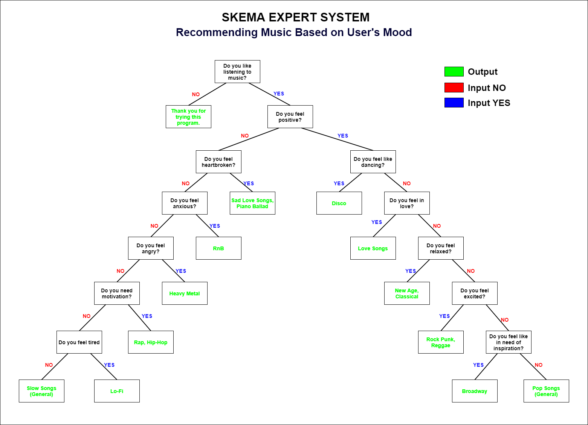

# Sistem Pakar : Memilih Genre Lagu Berdasarkan Mood User

Repository ini merupakan proyek ujian tengah semester dari praktikum Artificial Intelligence, Teknik Informatika Universitas Padjadjaran.

Program ini akan memberikan beberapa pertanyaan berdasarkan mood user, setelah semua inputan masuk maka program akan memberikan solusi genre lagu yang cocok untuk didengarkan.

## Credits
| NPM | Name |
| - | - |
| 140810190036 | M. Luthfi Taufiqurrahman |
| 140810190040 | Gregorius Evangelist Wijayanto |
| 140810190048 | Ihsanuddin Dwi Prasetyo |

## Running The Program
- Buka terminal pada OS masing-masing di folder prolog
- Ketik "swipl", kemudian ketik "consult('MAIN.PRO')"
- Untuk memulai program, ketik "go."
- Setelah program berjalan
  - Ketik "start." untuk memulai pertanyaan user
  - Ketik "quit." untuk keluar dari program
- Jika solusi sudah diberikan maka bisa "start." dan "quit." kembali
- Setelah keluar dari program dan ingin keluar dari sistem prolog, ketik "halt."

## Skema
